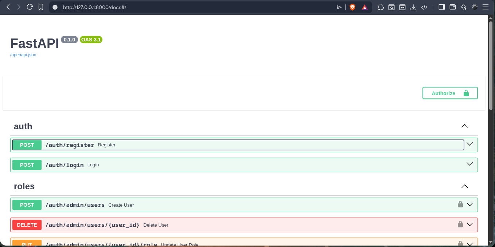
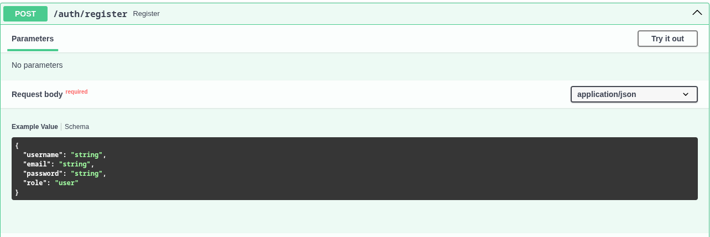
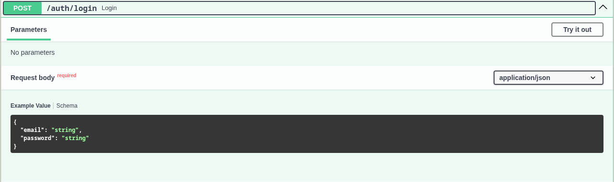
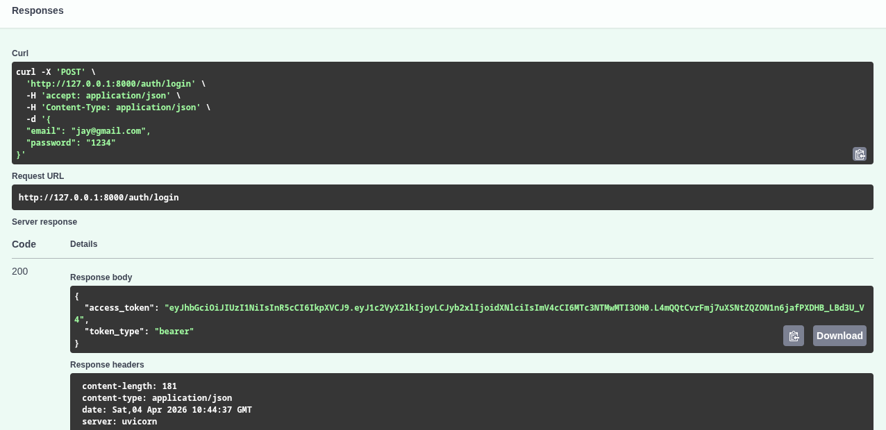
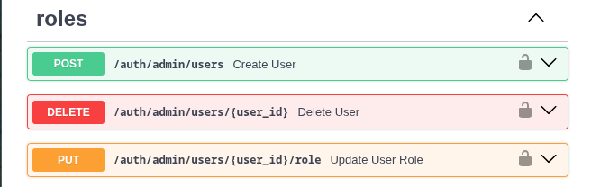

# FastApi_Backend
Backend for financial system using fastApi
=======
# Finance Backend API with Role-Based Access Control (RBAC)

## Overview

This is a backend finance system built using FastAPI and SQLite. It provides a robust API for user management, account handling, transaction tracking, and role-based access control (RBAC). The system ensures secure access to financial data with different permission levels for administrators, analysts, and regular users.

## Features

- **JWT Authentication**: Secure token-based authentication for user sessions.
- **Role-Based Access Control (RBAC)**: Three roles (Admin, Analyst, User) with specific permissions.
- **Account & Transaction Management**: Create, update, and track financial accounts and transactions.
- **Analytics & Filtering**: Advanced filtering and summary features for analysts.
- **SQLite Database Integration**: Lightweight, file-based database for easy deployment.
- **FastAPI Auto-generated Docs**: Interactive API documentation via Swagger UI.

## Roles & Permissions

### Admin
- Create, update, and delete users.
- Assign roles to users.
- Manage system-wide data.

### Analyst
- View all transactions with filtering options.
- Access analytical summaries and reports.

### User
- Access personal account data.
- View and manage own transactions.

## Tech Stack

- **FastAPI**: Modern, fast web framework for building APIs.
- **SQLAlchemy**: ORM for database interactions.
- **SQLite**: Embedded database for data storage.
- **JWT**: JSON Web Tokens for authentication.

## Prerequisites

- Python 3.8 or higher
- pip (Python package installer)

## Installation

1. **Clone the repository**:
   ```bash
   git clone https://github.com/Parbeen27/FastApi_Backend
   cd FastApi_Backend
   ```
   Copy .env.example to .env and optionally change values:
   cp .env.example .env

2. **Create a virtual environment**:
   ```bash
   python -m venv venv
   ```

   **Activate the virtual environment**:
   - On Windows:
     ```bash
     venv\Scripts\activate
     ```
   - On macOS/Linux:
     ```bash
     source venv/bin/activate
     ```

3. **Install dependencies**:
   ```bash
   pip install -r requirements.txt 
            or 
   run python install_requirements.py
   ```
4. **Run seed.py**:("for creating test users")
    python seed_user.py

5. **Run the server**:
   ```bash
   uvicorn main:app --reload
   ```

6. **Access the API documentation**:
   Open your browser and go to: [http://127.0.0.1:8000/docs]


## For full setup guide use setup.txt


## Testing the Application

### Step 1: Register a User
Use the `/register` endpoint and click ["try it out"] to create a new user.


**Example Request**:
```json
-for normal users:
{
  "username": "testuser",
  "email": "testuser@gmail.com",
  "password": "1234",
  "role": "user"   
}
-for admin
{
  "username": "testadmin",
  "email": "testadmin@gmail.com",
  "password": "1234",
  "role": "admin"   
}
-for analyst
{
  "username": "testanalyst",
  "email": "testanalyst@gmail.com",
  "password": "1234",
  "role": "analyst"   
}
```

### Step 2: Login
Use the `/login` endpoint to authenticate and obtain a JWT token.


**Example Request**:
```json
{
  "email": "admin@test.com",
  "password": "admin123"
}
```

**Response**: Copy the `access_token` from the response.


### Step 3: Authorize in Swagger UI
1. Go to the API docs at [http://127.0.0.1:8000/docs].
2. Click the "Authorize" button (🔒).
3. Enter: `<your_access_token>`

### Step 4: Test Role-Based Routes

#### Admin Routes
- `POST /admin/users` - Create a new user.
- `DELETE /admin/users/{id}` - Delete a user by ID.
- `PUT /admin/users/{id}/role` - Update user role by ID


#### Analyst Routes
- `GET /analytics/transactions` - Get filtered transactions.

#### User Routes
- `GET /users` - read users data if admin||analyst == all or any user data else: current user data.

### Step 5: Add Transaction
- `GET /api/transactions/` - read transactions history 
- `POST /api/transactions` - create transactions with time-based data
**Example Create Transactions**:
-for cash deposit
{
  "type": "deposit",
  "amount": 1000,
  "receiver_email": "user@example.com",  //default receiver_email
  "description": "amount added"
}
-for cash withdrawl
{
  "type": "withdrawl",
  "amount": 1000,
  "receiver_email": "user@example.com",   //default
  "description": "amount added"
}
-for cash transfer
{
  "type": "transfer",
  "amount": 1000,
  "receiver_email": "testadmin@gmail.com", //add receiver_email
  "description": "amount added"
}
**Example response body**:
{
  "id": 1,
  "category": null,
  "receiver_id": null,
  "created_at": "2026-04-04T11:19:27.714269",
  "amount": 1000,
  "type": "deposit",
  "user_id": 1
}
### Step 6: View Summary of transaction
- `GET /api/summary` - view summary of income,expenses,balance
**Example summary**:
{
  "message": "Summary created successfully",
  "summary": {
    "income": 1100,
    "expenses": 100,
    "balance": 1000
  }
}
## Example API Flow

1. **Register** → Creates a new user account.
2. **Login** → Returns a JWT token.
3. **Use Token** → Access protected routes based on user role.
4. **Role Permissions** → Determines what actions the user can perform.

## Authentication

The application uses JWT (JSON Web Tokens) for authentication:
- Tokens include `user_id` and `role`.
- Tokens are required for accessing protected routes.
- Include the token in the `Authorization` header as `<token>`.

## Future Improvements

- Implement pagination for large transaction lists.
- Develop an advanced analytics dashboard.
- Add Docker support for containerized deployment.
- Introduce audit logging for security tracking.

## Contributing

Contributions are welcome! Please follow these steps:
1. Fork the repository.
2. Create a feature branch.
3. Make your changes.
4. Submit a pull request.

## License

This project is licensed under the MIT License. See the LICENSE file for details.

## Author

Parbeen Singh Panwar
